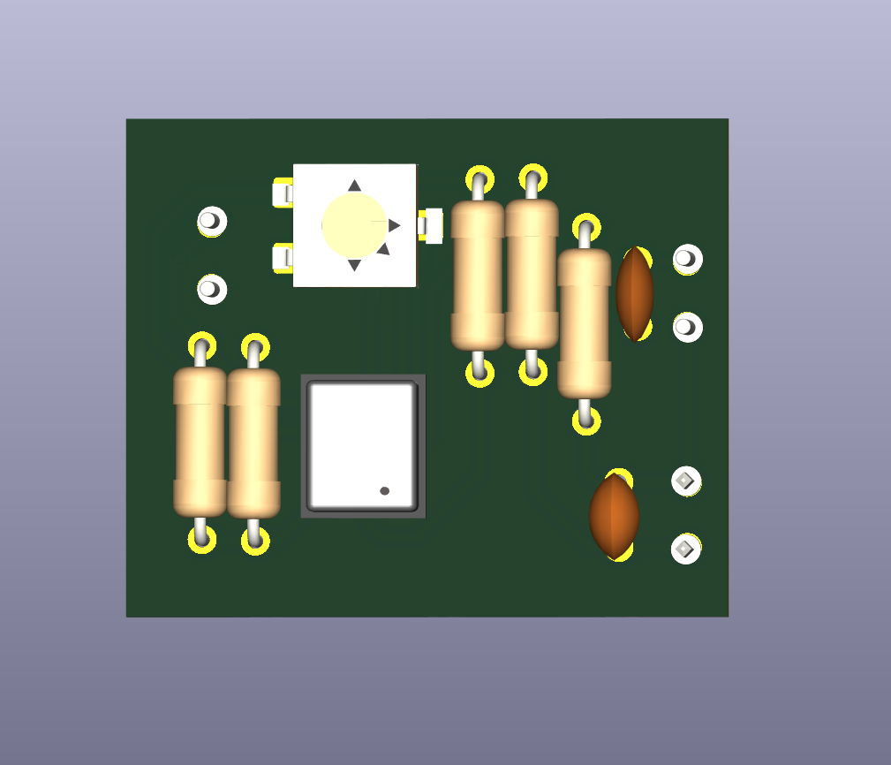
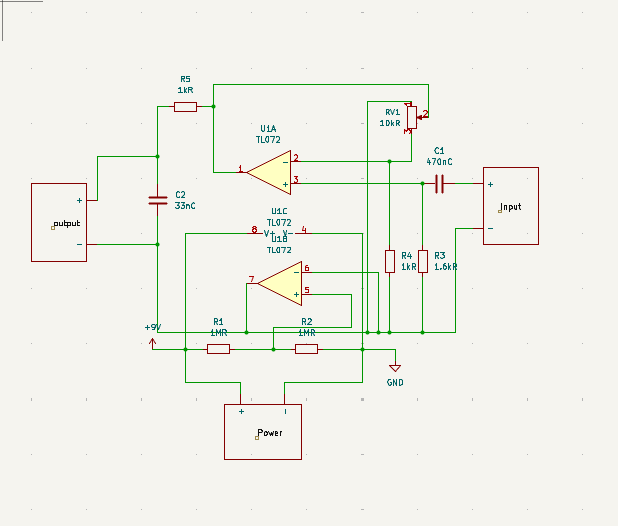
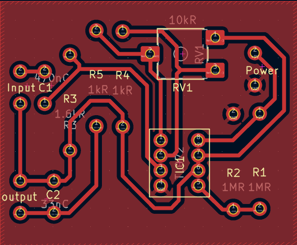

# Active Band-Pass Filter Design

## Project Overview
This project showcases a complete hardware design cycle for an Active Band-Pass Filter using the **TL072 Operational Amplifier**. It transition from theoretical calculations to a fully routed PCB layout ready for manufacturing.

## Key Design Features
*   **Active Stage:** Utilizes a TL072 dual op-amp for high input impedance and low noise.
*   **Variable Tuning:** Includes a 10kΩ potentiometer (RV1) for adjustable gain/frequency response tuning.
*   **Signal Integrity:** Optimized 2-layer PCB layout with a dedicated ground plane to minimize noise interference.

## Design Files
### 1. Schematic Design
The schematic features a dual-supply op-amp configuration (powered via the 9V Power block) with a High-Pass stage (C1/R3/R4) and a Low-Pass stage (C2/R5/RV1).

### 2. PCB Layout
The board is designed for manual assembly using through-hole components. 
*   **Trace Width:** Sized for reliable signal delivery and ease of soldering.
*   **Component Placement:** Logically grouped to keep signal paths short.

